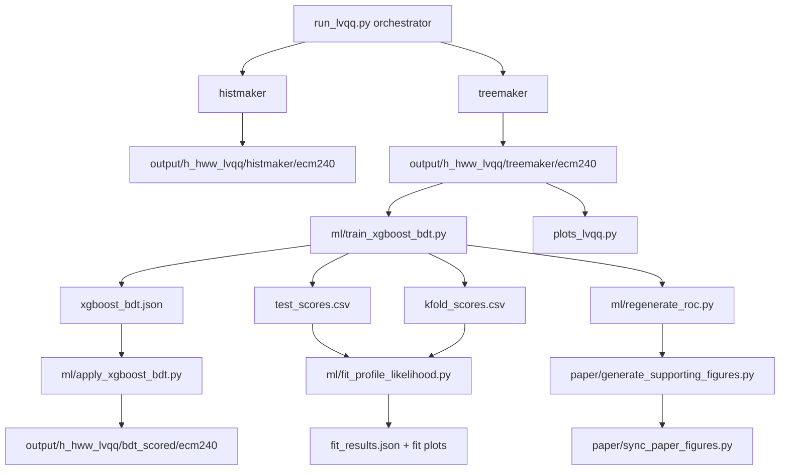
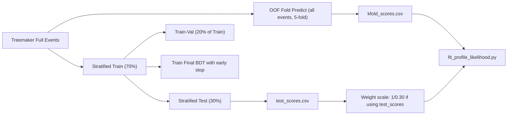
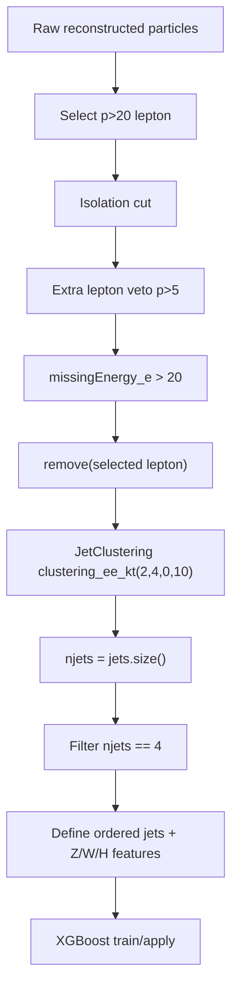
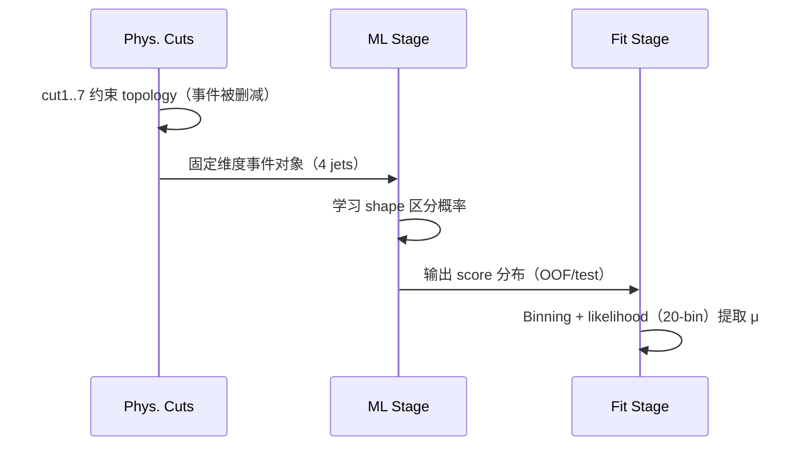

# FCC lvqq ML Pipeline: Architecture, Cuts, Training, and Fit（汇报版）

## 一句话先说清（用于开场 30 秒）

- 这是一个完整的 **FCC-ee e+e− → ZH → (qq)(ℓνqq)** 端到端链路：  
  先做物理重建与 cut 预筛（`h_hww_lvqq.py`）→ 训练 XGBoost BDT 并直接产出 `test_scores.csv/kfold_scores.csv`（`ml/train_xgboost_bdt.py`）→ 用这些 score 做 20-bin 模板的 profile likelihood 拟合（`ml/fit_profile_likelihood.py`）。  
  `ml/apply_xgboost_bdt.py` 是额外的 scored-ROOT 输出支线，不是当前默认 fit 输入。
- 你用的是 **XGBoost BDT**，不是 DNN 或 Graph NN。  
- **cut5（`njets == 4`）是事件级 filter，明确的事件筛选，不是“仅派生变量”**。  
- 防过拟合不是单点策略，而是多层机制叠加：分层划分、内部验证+early stopping、k-fold OOF、KS/KS-overtraining 诊断、统计约束与可复现日志。

---

## 问题快速回答（可直接对 Jan 复述）

1. **你用的模型是什么？**  
   `ml/train_xgboost_bdt.py` 使用 `xgboost.XGBClassifier`（binary:logistic），目标是二分类 signal vs background，输入是 `ML_FEATURES`。

2. **cut 和 filter 的关系是什么？**  
   `h_hww_lvqq.py` 的 cut 是按事件 topology 逐步筛选，`cut5` 的逻辑是：
   1) 去掉选中的孤立 lepton；2) 对剩余对象做 4 阶段 jets 聚类；3) 定义 `njets`；4) `Filter("njets == 4")`。  
   因此 cut5 同时包含重建边界和硬筛选，直接改变事件集合。

3. **数据怎么分？**  
   - 在 train 脚本里，先 `train_test_split(..., test_size=0.30, stratify=y)` 形成 train/test。  
   - 然后在 train 内再切一层 val（`train_test_split(..., test_size=0.20, stratify=y_train)`）用于 early stopping。  
   - `--kfold` 默认 5，用于 OOF 全样本打分。

4. **fit 用什么输入？**  
   `fit_profile_likelihood.py` 优先读 `kfold_scores.csv`；没有则退回 `test_scores.csv`，并按 `1/0.30` 进行权重反推以恢复全样本口径。

5. **谁先谁后？**  
   物理 cut 在 ML 之前；默认统计链是 `train -> fit`；`apply` 负责把模型重新打回 ROOT 树，属于平行产物链，不是 fit 的前置条件。

---

## 关键链条（最短版）

---

## 数据集与权重（防失真核心）

### 物理样本定义
- Signal：`wzp6_ee_qqH_HWW_ecm240`, `wzp6_ee_bbH_HWW_ecm240`, `wzp6_ee_ccH_HWW_ecm240`, `wzp6_ee_ssH_HWW_ecm240`（标签 1）
- Background：WW/ZZ + qq 组（`wz3p6_ee_*`）+ tautau + ZH 其他 Higgs 分支（标签 0）
- 这在 `ml_config.py` 与 `SAMPLE_INFO` 中有统一映射，训练/fit 使用同一套样本家族。

### 物理权重口径
- 每事件权重公式（当前实现）  
  `phys_weight = INT_LUMI * xsec / ngen / fraction`
- 意图：把 MC 分布映射到 10.8 ab^-1 统计量级，保持跨样本的可比 yield。
- 另有 `normalize_class_weights`：按总权重对信号与背景做平衡，减少 class 不平衡引导的过拟合倾向。

### split 口径
- split1：train/test = 70% / 30%，`random_state` 固定  
- split2：在 train 内部再划 20% val（用于 early stop）
- split3：`--kfold` 做 OOF（默认 5）

---

## 训练细节（ML解释 + 物理解释）

### 为什么用 BDT
- 目标是 topological separation：信号/背景在 jet/lepton 质量、角度、重建量上的非线性边界。
- XGBoost BDT 对这类手工特征（`ML_FEATURES`）在小样本和强物理先验下稳定、可解释，并可输出排序能力良好的 score。

### 训练过程
- 读入 treemaker 树 → 筛掉缺失树/空树/坏样本 → 按 `ML_FEATURES` 对齐列。
- Grid Search + early stopping：通过验证集自动确定有效树数（`early_stopping_rounds=30`），每个候选在同一评估协议下比较。
- 最终用 train 内部 val 做 early stopping，保留 `best_iteration` 对应树数，输出最终模型。
- 输出：`xgboost_bdt.json`, `training_metrics.json`, `test_scores.csv`, 可选 `kfold_scores.csv`, 以及诊断图。
- 若再运行 `apply_xgboost_bdt.py`，才会另外得到 `output/h_hww_lvqq/bdt_scored/ecm240/*.root`。

### 你们目前的 cut 在训练前后关系
- cut5 及后续 cut6/cut7 在物理前处理已完成（treemaker）。  
- ML 输入是“已筛选且重建一致”的事件，避免了 `njets!=4` 等不规则结构进入模型导致特征顺序不一致。

---

## 防过拟合机制（客观评价）

### 已有控制点
- `stratified` 划分，保证每类比例一致，减少分布漂移。
- 训练/验证拆分 + early stopping（内部 validation AUC 监控）。
- `normalize_class_weights` 抑制权重主导学习。
- 网格搜索在 train 内部，避免把 val 与 hyper-param 搜索混为一体。
- 额外的独立 OOF（`kfold_scores.csv`）用于 fit，而不是只用 30% test。
- 训练后 KS-overtraining（加权+未加权）与 train/test AUC 差值诊断。
- 物理变量层面有合理检查（`missingMass` 哨兵修复、分布对比、sculpting diagnostics）。

### 可继续加固的点（高优先）
- `scale_pos_weight` / `max_delta_step` 级别做系统扫描，减少极端类别尾部过合。
- 外层 `sample_weight` 的 bootstrap 重采样稳定性验证（repeat seeds）。
- 学习率与树深度的联合网格替换当前固定 1000 trees 结构。
- 在 fit 前后都用固定随机种子+版本锁（xgboost/numba/sklearn）提升可复现性。

---

## 5-fold 作用（核心误解点）

- 5-fold 不是“又训练一次拿平均 AUC”这么简单，它是为了**给 fit 提供无泄漏打分表**。  
- `test_scores.csv` 只包含 30% hold-out，若直接作全统计拟合会发生规模和不确定度下估计。  
- `kfold_scores.csv` 覆盖全样本、每折只对外折预测，理论上更接近“每个事件都有 out-of-fold 预测”的 unbiased score。  
- `fit` 里明确优先读取 kfold；若缺失，才回退 test_scores 并缩放 `1/0.30`。

---

## fit 与 BDT 的关系（从 score 到统计）

`fit_profile_likelihood.py` 的工作是把 BDT score 当作可观测变量建立模板：
- `build_templates` 按 score bin 给出 signal/background 可见 yield；
- 背景按 WW / ZZ / qq / tautau / ZH_other 独立建模；
- `mu` 是 POI（信号强度），背景组加 `normsys`，并可加 `staterror`；
- 20-bin 多段拟合与 cut scan 共用同一套 score observable，`fit_nbins=1` 用于 cut-and-count 参考。

---

## 阶段化 Slide 方案（建议 14 页）

### Slide 1 开场
- 这是一个什么物理信号、为什么选择 BDT、一句话主结论  
- 备注：在一句话里交代“不是单纯 cut 增益，而是 cut + shape fit + 系综统计”。

### Slide 2 数据与脚本入口
- `run_lvqq.py` 的 stage 控制（histmaker/treemaker/train/apply/fit/plots）
- `ml_config.py` 如何统一样本、分组、fraction
- 这里要特别讲清：默认统计输入来自 `train` 产物里的 CSV，不是 `apply` 后的 ROOT。

### Slide 3 事件拓扑与 cut1~cut7
- 逐步列出每个 cut 的物理动机（especially cut5）
- 列出 cut 后事件是否进入 ML

### Slide 4 cut5 深挖：4 jets 为什么是 filter
- 画一个 cut5 前后流程图（去 leptons→聚类→`njets==4`）
- 强调“统一 event schema 给 BDT”的物理与工程意义

### Slide 5 数据分割与可复现性
- 70/30 + 20% val + 5-fold OOF
- 训练/验证/test 对应的用途边界

### Slide 6 权重与样本平衡
- `phys_weight` 公式
- Class normalize 的作用
- 为什么不直接用 event count

### Slide 7 训练流程
- 参数网格、early stop、训练历史
- 为什么不是“盲目堆树”

### Slide 8 过拟合监控
- train/test AUC、delta AUC、加权/未加权 KS
- 何时判定过拟合，如何回退

### Slide 9 k-fold 争议与答案
- test_scores vs kfold_scores 对比逻辑图
- fit 为什么优先 kfold

### Slide 10 Score 到 likelihood
- 20-bin 形状拟合图示（模板定义）
- `mu`、normsys、staterror 的含义

### Slide 11 cut scan 与最终工作点
- 1-bin counting scan 与 shape fit 的区别
- 为什么 scan 只用于策略选择，不是最终统计结论

### Slide 12 结果解读
- `fit_results.json` 字段解读（mu_hat, μ uncertainty, nuisance）
- 物理意义是 σ×BR 的期望精度

### Slide 13 诊断闭环
- plots_lvqq、roc、pairing validation、论文图同步
- 一致性检查 checklist（每次改 cut 或改参数必须看哪些图）

### Slide 14 结论与下一步
- 我们的链路是否稳健
- 下一轮可以改的实验列表（cut阈值、背景 fraction、树深度/采样参数）

---

## 可视化图清单（可直接放进 slides）

### 图 1：全流程链路图
见上文流程图（Mermaid）。  
用途：给 jan 看“先后顺序”和“默认统计链 vs 额外 ROOT 产物链”。

### 图 2：样本分层与评分流

### 图 3：cut5 解释图（你被问到的核心）

### 图 4：建议的 cut5 先后与信息保真图

---

## 学习顺序（建议按这个顺序读源码）

1. `ml_config.py`  
   先读：样本列表、fraction 环境变量、ML 特征和默认路径。
2. `h_hww_lvqq.py`  
   明确 7 个 cut 的物理意义（尤其 cut5）。
3. `run_lvqq.py`  
   理解 orchestration、不同 target 的执行关系（stage1/ml/all）。
4. `ml/train_xgboost_bdt.py`  
   按 `main` 读懂数据组装、split、grid search、early stop、OOF。
5. `ml/fit_profile_likelihood.py`  
   先读默认统计链：kfold 优先、test 缩放、模板拟合和 nuisance 结构。
6. `ml/regenerate_roc.py` 与 `ml/apply_xgboost_bdt.py`  
   再看训练质量诊断与 inference 复用。
7. `plots_lvqq.py` + `paper/generate_supporting_figures.py` + `paper/sync_paper_figures.py`  
   读最终可展示图和 cut 检查。

---

## 输出映射（汇报页脚可直接引用）
- Physics reconstruction / cut: `h_hww_lvqq.py`
- Workflow orchestration: `run_lvqq.py`
- Training/inference artifacts: `ml/train_xgboost_bdt.py`, `ml/apply_xgboost_bdt.py`
- Statistical interpretation: `ml/fit_profile_likelihood.py`
- Diagnostics & paper: `plots_lvqq.py`, `paper/*`
