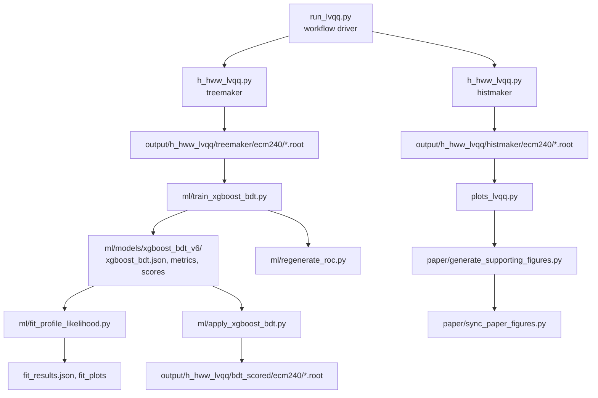

# FCC Lvqq Pipeline: Study Notes and Line-by-Line Annotations (English)

This file is an analysis-oriented walkthrough of all Python scripts in this repository for learning and review.
It maps each script to a learning checkpoint, and explains every major section by line ranges.

## Big Picture Map

## High-level Learning Order (recommended)

1. `ml_config.py`  
   Learn constants and sample/weight assumptions first.
2. `run_lvqq.py`  
   Understand execution modes (`histmaker`, `treemaker`, `train`, `apply`, `fit`, etc.).
3. `h_hww_lvqq.py`  
   Build physics selections (cuts), reconstructed variables, and output branches.
4. `plots_lvqq.py`  
   Understand the cut-flow table conventions and plotting assumptions used in paper-style outputs.
5. `ml/train_xgboost_bdt.py`  
   Study dataset assembly, weighting, hyperparameter scan, training, k-fold scoring.
6. `ml/fit_profile_likelihood.py`  
   Learn the inference target and treatment of uncertainties.
7. `ml/regenerate_roc.py`  
   Read diagnostics path and how ROC is used for sanity checks.
8. `ml/apply_xgboost_bdt.py`  
   Apply trained model and preserve feature contract with training.
9. `paper/generate_supporting_figures.py`  
   Produce additional figures used to validate reconstruction/kinematics.
10. `paper/sync_paper_figures.py`  
    Check final artifact packaging into the paper folder.

## 1) ml_config.py (global configuration and policy)

- `1-22`: imports and fraction parsing helper functions (`_parse_fraction_value`, `_default_background_fractions`).
  - Core policy: every sample-processing fraction must be in `(0,1]`, and invalid env values should fail fast.
- `24-42`: `_parse_background_fractions` merges global override + per-process overrides from env vars.
  - This is where runtime reproducibility is controlled without touching code.
- `44-47`: spectator list for ML output writing.  
  - `weight` and `njets` are intentionally not used as input features.
- `49-76`: feature list for training (`ML_FEATURES`).
  - Includes commented redundancies; they help explain prior experiments but are excluded now.
- `78-85`: signal and background sample groups.
  - `BACKGROUND_SAMPLES` currently equals `FULL_BACKGROUND_SAMPLES` (WW, ZZ, qq, tautau + all hadronic ZH).
- `87-150`: sample fraction map.
  - Keeps all listed samples aligned with upstream `h_hww_lvqq.py` fraction behavior.
- `153-156`: default runtime constants for tree/model/scoring naming.
  - `DEFAULT_MODEL_DIR`, `DEFAULT_TREEMAKER_DIR`, `DEFAULT_SCORE_BRANCH`.

## 2) run_lvqq.py (orchestration and submission driver)

- `29-17` (module constants): command pathing and defaults.
- `33-43`: `parse_fraction`, `default_background_fractions` CLI parsing.
- `33-43` and `45-42`: `run_bash` wraps command execution with optional FCCAnalyses setup.
- `45-88`: action helpers for each step.
  - `histmaker`: set `LVQQ_MODE=histmaker` and run FCCAnalyses.
  - `treemaker`: set `LVQQ_MODE=treemaker`.
  - `train`/`apply`/`fit`/`roc_plot`/`supporting_figures`/`sync_paper_figures`.
- `49-87`: plotting chain is hierarchical (`plots` runs ROC + paper figures).
- `84-90`: `step_paper` also calls all paper preparation pieces.
- `91-127`: Slurm submit path for heavy jobs.
  - Adds `--parsable`, job name, cpu/mem/time, and passes the full re-run arguments.
- `131-239`: sequence map.
  - `all` executes pipeline end-to-end from histogramming to paper outputs.
- `218-236`: target mappings for compact execution.
  - `stage1`: histmaker + treemaker; `ml`: train + fit + apply.
  - This order is intentional: current `fit_profile_likelihood.py` consumes CSV score artifacts from training, so it does not need the scored ROOT ntuples from `apply_xgboost_bdt.py`.
- `168-243`: fraction environment is injected before each run so downstream modules stay synchronized.

## 3) h_hww_lvqq.py (physics object reconstruction and cutflow)

### Global setup
- `14-23`: imports and ROOT defaults.
- `21-26`: `ecm`, `mode`, validation of mode, `treemaker` toggle.
- `29-38`: worker parallelism parser with strict integer checks.
- `39-44`: `processList` built from `SIGNAL_SAMPLES` + `BACKGROUND_SAMPLES` with per-sample fractions.
- `46-54`: input/output paths and mode-dependent output directory.
- `57-64`: parallel worker setup + prints for background fractions.

### Build graph: `build_graph_lvqq(df, dataset)` (`79-229`)

- `82-85`: basic event variable bootstrap and cut-flow bookkeeping.
- `91-102`: aliasing muon/electron collections and building lepton candidates.
- `98-104` (`cut1`): exactly one high-PT lepton (`p>20`), then cutflow booking.
- `108-114` (`cut2`): lepton isolation requirement `lepton_iso < 0.15`.
- `116-121` (`cut3`): lepton-veto at `p>5` to keep exactly one reconstructed lepton.
- `124-134` (`cut4`): missing-energy observables and `missingEnergy_e > 20`.
- `136-154` (`cut5`): **most important filter/selection question**.
  - `rps_no_leptons = remove(leptons_p5)` removes the selected lepton.
  - `clustered_jets = clustering_ee_kt(2, 4, 0, 10)(pseudo_jets)` creates exactly four exclusive jets at clustering stage.
  - `df.Filter("njets == 4")` is the explicit topology requirement/filter for this step.
  - This is both a filter and a reconstruction boundary: events with a different final jet multiplicity are dropped.
  - It is not a “4-jet selection by external logic” after clustering; clustering is intentionally forced to 4 before this explicit filter.
- `157-166`: per-jet momentum variables and `jet_p_sum`.
- `167-178`: convert jets to four-vectors + `pairing_Zpriority_4jets`.
  - `Zcand` and `Wstar` are assigned by pair mass-compatibility logic.
- `179-200`: derived reconstruction masses (`Zcand_dm`, `Wstar_m`, `recoil_dmH`, `totalJetMass`, `thrust`, etc.).
- `195-199`: recoil construction from `ecm` against reconstructed Z candidate.
- `201-215`: leptonic W (`Wlep`) and Higgs candidate (`Hcand`) masses.
- `217-220` (`cut6`): on-shell Z window `|mZ-91.19| < 15`.
- `223-226` (`cut7`): recoil window `|m_higgs_recoil - 125| < 20`.

- `231-241`: output interface
  - `treemaker` branch returns `df` with spectator+feature list.
  - `histmaker` branch returns `(hists, weightsum)` for histogram-driven workflow.

## 4) plots_lvqq.py (analysis diagnostics and cutflow tables)

- `11-40`: imports + histogram style constants.
- `41-82`: process and histogram configuration.
  - merges qq and hadronic-Z groups for cleaner plotting.
  - cut labels are intentionally aligned to `cut0..cut7`.
- `100-160`: ROOT style setup (`setStyle`) and histogram fetch utility.
  - `getHist` includes safe merging behavior for logical groups.
- `163-216`: `collectCutflowData`.
  - per-process yields, total signal/background, `S/B`, `S/√B`, efficiencies.
- `219-236`: formatting helpers for table rows.
- `246-277`, `278-308`, `311-339`: cutflow in text/latex/pdf forms.
- `340-439`: cut efficiency text/latex/pdf.
- `440-517`: `makeCutflowPdf` styling/layout details.
- `504-669`: `makePlot` single stacked plot (bkg + signal sum), legend, axis ranges.
- `671-757`: `makeNormalizedPlot` for normalized shape plots.
- `763+`: plot table and main loop in `if __name__ == "__main__":` for all configured histograms.

## 5) ml/train_xgboost_bdt.py (training, scoring, validation, diagnostics)

### Config and I/O metadata
- `1-15`: docstring + imports.
- `31-44`: path setup + imports from `ml_config`.
- `46-86`: `SAMPLE_INFO` and luminosity.
  - Physics weights are explicit and include both cross section and generated event counts.
- `90-107`: CLI arguments: output/input/test-size/seed/folds/grid/plot/plotting control.

### Data ingestion and preprocessing
- `110-133`: `get_tree_status` to print missing-tree/selected/processed metadata.
- `136-190`: `read_samples`.
  - loads each sample, validates branches, computes `phys_weight`, labels, and concatenates.
  - scales by fraction-aware normalization from `SAMPLE_PROCESSING_FRACTIONS`.
- `193-212`: `normalize_class_weights`.
  - class balancing by matching total event weight scale across signal/background.
- `214-247`: weighted KS-like diagnostic helper.
- `249-260`: train/validation split helper (disjoint split for model internals).

### Hyperparameter and model training
- `262-300`: `fit_with_early_stopping`.
  - internal split for validation, trains with early stopping, then retrains on full training split.
- `302-388`: `grid_search`.
  - subsample up to 50k events, early-stopped grid sweep, tracks best AUC and params.
- `390-549`: `make_plots`.
  - ROC, signal efficiency vs background rejection, overtraining plots, feature importance, sculpting checks.
- `551-587`: `kfold_score_all`.
  - 5-fold (or user-defined) unbiased scoring of all events.
  - prevents using only 30% test fraction for the final statistical fit.
- `590-796`: `main`.
  - read signal/background samples.
  - drop sentinel missingMass values.
  - compute class-balance diagnostics and split.
  - grid search or fallback parameters.
  - fit with early stopping + overtraining checks (weighted and unweighted).
  - persist: model, metrics, training history, feature importance, `test_scores.csv`, and optional `kfold_scores.csv`.
  - `overtraining_flag` is explicitly stored in metrics, not just printed.

## 6) ml/regenerate_roc.py (ROC generation utility)

- `2-15`: module purpose and imports.
- `27-37`: model output import path and access to `read_samples`.
- `31-45`: `make_axes` helper with FCC-ee annotations.
- `48-67`: `save_kfold_roc`.
  - uses `kfold_scores.csv`; preferred source for unbiased performance.
- `69-117`: `save_split_diagnostic`.
  - optional train/test ROC to contrast train and holdout behavior.
- `119-137`: CLI + `main` orchestration.

### Key point
- This script is diagnostic only; it never changes model coefficients.

## 7) ml/apply_xgboost_bdt.py (inference on treemaker trees)

- `28-37`: CLI and defaults.
- `40-46`: load feature list from training metadata JSON.
- `49-73`: `get_tree_status` to ignore 0-pass or empty trees.
- `75-123`: main loop:
  - load each sample tree,
  - assert required features exist,
  - compute `model.predict_proba(... )[:,1]`,
  - write scored ROOT files to `output/h_hww_lvqq/bdt_scored/ecm240`.
- The output branch (`bdt_score` by default) is what downstream fit scripts expect.

## 8) ml/fit_profile_likelihood.py (template fit and uncertainty extraction)

- `1-17`: objective and methodology in header.
- `34-38`: CSV loader.
- `40-102`: `build_templates`.
  - builds 1D histograms for signal/background groups.
  - backgrounds grouped as WW / ZZ / qq / tautau / ZH_other.
- `104-177`: `build_pyhf_model`.
  - creates shape model with `mu` POI, per-background `normsys`, and optional `staterror`.
  - signal and backgrounds use non-zero floor guards.
- `180-248`: `fit_asimov`.
  - Asimov data at mu=1, numerical NLL minimization + Hessian-based uncertainty.
- `250-300`: `scan_bdt_cut`.
  - scans BDT cut points for fixed nbins; 1-bin for counting-style comparison.
- `303-549`: `make_fit_plots`.
  - scan curve, template overlays, rank-ordered bins and purity.
- `551-710`: `main`.
  - chooses score input with preference `kfold_scores.csv` over `test_scores.csv`.
  - scales weights when using test scores only (`/0.30` correction).
  - runs optional counting scan, then selected-bin shape fit (`--nbins` default 20),
    saves `fit_results.json` and plots.

### Important workflow clarification
- The default statistical fit path is `train_xgboost_bdt.py -> fit_profile_likelihood.py`.
- `apply_xgboost_bdt.py` writes scored ROOT ntuples for downstream inspection or future workflows, but the current fit script does not read those ROOT outputs by default.

## 9) paper/generate_supporting_figures.py (extra plots for physics checks)

- `21-35`: paths and physics constants.
- `52-67`: histogram loading and normalization helpers.
- `75-105`: weighted branch loading from treemaker for shape plots.
- `108-173`: `make_pairing_validation`
  - compares signal and WW backgrounds on key reconstructed masses.
- `173-210`: `make_d34_distribution`.
  - distribution of `sqrt(d_34)` as a jet-shape discriminator.
- `212-267`: small diagram-drawing utility helpers (`draw_straight_line`, fermion, boson).
- `296-359`: `make_feynman_diagram` manually draws hadronic WW* topology.
- `362-368`: `main` executes three figure families and prints completion.

## 10) paper/sync_paper_figures.py (publication packaging)

- `15-28`: figure stems and appendix figure lists.
- `50-65`: `caption_for_plot` centralizing figure labels.
- `68-104`: `write_appendix_tex`, writes `appendix_plots.tex`.
- `106-147`: `main`.
  - copies curated figures into `paper/figs`,
  - keeps only expected file set,
  - fails fast if required outputs are missing.

## 11) Cut5 clarification (4-jet question)

The `cut5` branch in `h_hww_lvqq.py` is not just a post-hoc label cut:

1. Remove selected leptons from the particle collection.
2. Convert remaining candidates to pseudo-jets.
3. Build exclusive `ee-kt` clustering with fixed target count = 4 jets.
4. Store `njets = jets.size()`.
5. Filter with `njets == 4`.

That means both:  
- a topology reconstruction step (`clustering_ee_kt(2, 4, 0, 10)`), and  
- an explicit event filter (`Filter("njets == 4")`).

It is therefore a reconstruction + selection boundary, not a generic “veto” cut.

## 12) Suggested deep-dive rhythm (for learning)

### Stage 1 (physics grounding)
Read `ml_config.py` and then `h_hww_lvqq.py` fully.

### Stage 2 (pipeline flow)
Run mentally and then from command line:
- `run_lvqq.py stage1`
- `run_lvqq.py histmaker`
- inspect output histogram files.

### Stage 3 (ML chain)
Step through:
- `train_xgboost_bdt.py` main path
- `regenerate_roc.py`
- `apply_xgboost_bdt.py`
- `fit_profile_likelihood.py`.

### Stage 4 (publication checks)
Read `plots_lvqq.py` and then `paper/generate_supporting_figures.py`, `paper/sync_paper_figures.py`.

### Stage 5 (experiments)
Change one variable at a time:
- one cut threshold,
- one training hyperparameter grid dimension,
- one background fraction env variable.
Then rerun `train` and `fit` only, compare `fit_results.json` and scan plots before revisiting selection plots.
